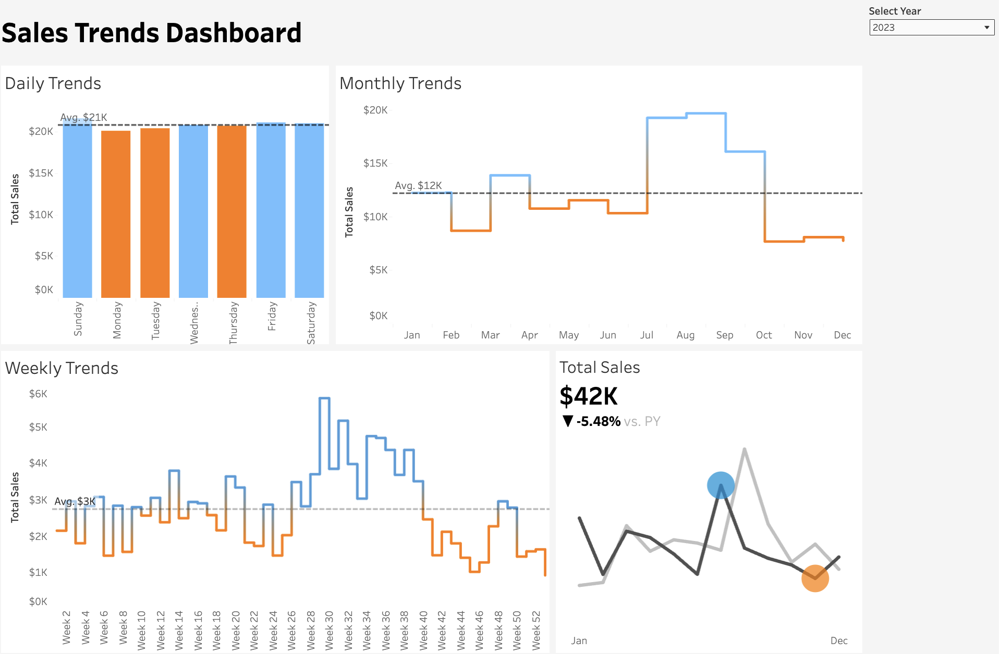

# 📊 Sales Trends Visualization (Tableau)

Created an interactive Tableau dashboard to explore seasonal sales trends from my personal eBay dataset (2021–2024). The dashboard breaks down sales performance by day of week, week of year, and month, revealing when sales peak or decline. Key features include:

- Daily Trends: Sundays and Saturdays consistently outperform weekdays, averaging over $21K, signaling strong weekend demand.
- Monthly Trends: Sales spike in August but drop sharply in October, with an average monthly sales benchmark of $12K shown as a reference line.
- Weekly Trends: Week 31 (late July to early August) sees the highest revenue, while Week 53 (end of December) shows a steep drop—highlighting a 95% decline in weekly sales.
- Total Sales KPI Tile: Displays total annual revenue (e.g., $42K in 2023), with year-over-year performance comparison (▼ -5.48% vs. previous year).
- Dynamic Tooltips & Highlights: Allows users to quickly identify performance highs/lows and track seasonal shifts.

This dashboard empowers quick diagnosis of underperforming periods (like Q4) and supports strategy development around free shipping, category prioritization, and holiday event planning.

